# Огляд наявних супутникових даних - 2022

## Ціни
[:moneybag: мультиспектральні та високої роздільної здатності](https://github.com/SergeyShchus/Online-Investigation-Toolkit/blob/master/satellite-imagery-datasets/Example/Apollo_Mapping_Imagery_Price_List.pdf)

[:moneybag: Моделі рельєфу](hhttps://github.com/SergeyShchus/Online-Investigation-Toolkit/blob/master/satellite-imagery-datasets/Example/ApolloMapping_DEM_Price_List_Product_Spec.pdf)

## Супутники

|Супутник |Країна |Тип сенсора |Роздільна здатність | Доступ | Приклад у реальному розмірі|

-------

|:artificial_satellite: Pleiades|:round_pushpin: Франція |:camera: тип - мультиспектральні| роздільна здатність - 0,5 - 2,8m | [:moneybag: заказ ](https://www.intelligence-airbusds.com/en/4871-ordering)| [:earth_americas:  приклад]|

  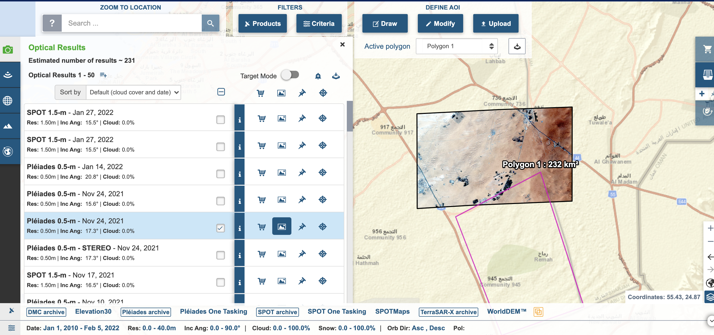

  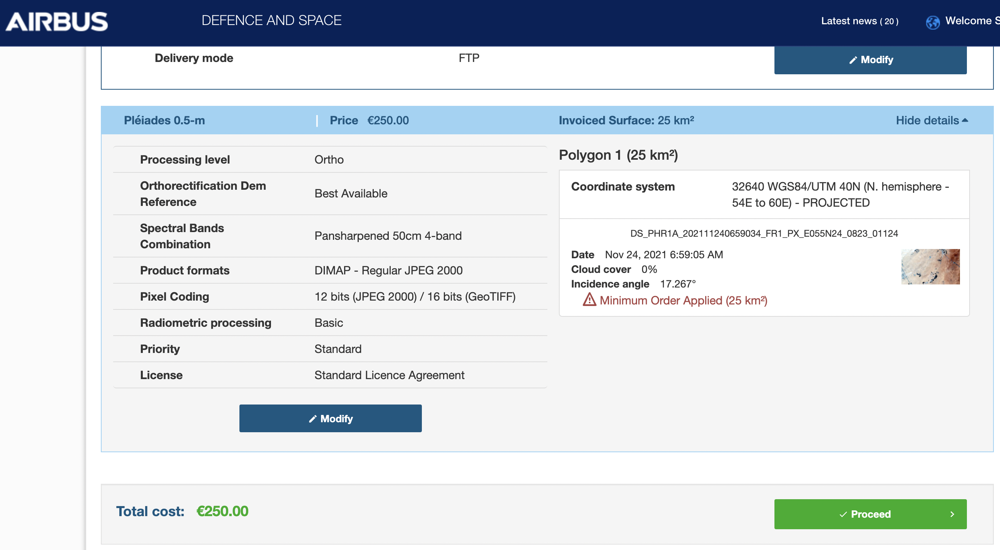

---

|:artificial_satellite: SPOT 6-7 | :round_pushpin: Франція |:camera: тип - мультиспектральні| оздільна здатність -  1,5m | [:moneybag: заказ ](https://www.intelligence-airbusds.com/en/4871-ordering)|[:earth_americas:  приклад](https://www.kaggle.com/sergiishchus/spot-7-optical-imagery)|

  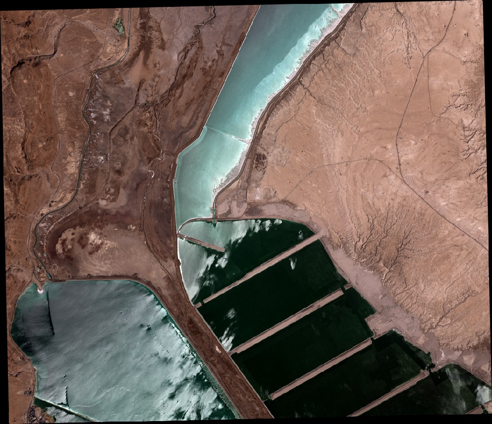

---

|:artificial_satellite: SPOT 6-7 | :round_pushpin: Франція |:camera: тип - активний сенсор (радар)|роздільна здатність -  0,7m | [:moneybag: заказ ](https://www.intelligence-airbusds.com/en/4871-ordering)|[:earth_americas:  приклад](www.kaggle.com/dataset/e893289607433768925849896b7a269f02d9c170ef7e755fee461f128ea2d987)|

  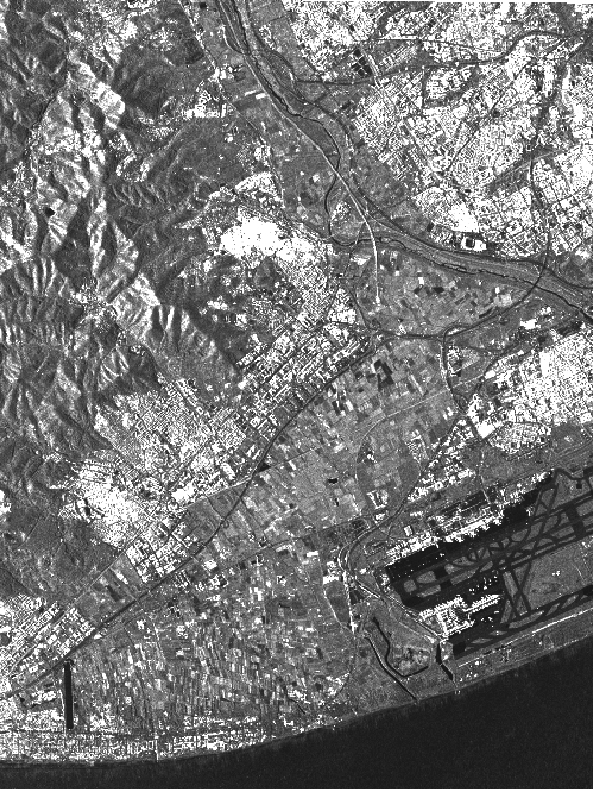

---

|:artificial_satellite: SPOT 6-7 | :round_pushpin: Франція |:camera: тип - Elevation10 DSM |роздільна здатність -  10 m | [:moneybag: заказ ](https://www.intelligence-airbusds.com/en/4871-ordering)|[:earth_americas:  приклад](https://www.kaggle.com/sergiishchus/spot-67-elevation10-dsm)|

  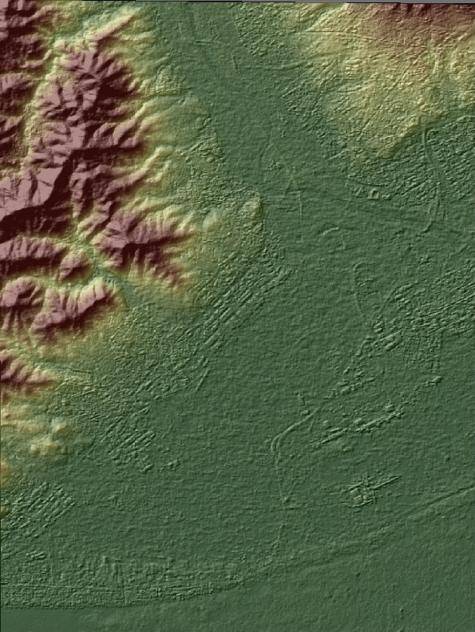

---

|:artificial_satellite: Pléiades | :round_pushpin: Франція |:camera: тип - Panchromatic Stereopairs. Elevation 4 m |роздільна здатність -  4 m | [:moneybag: заказ ](https://www.intelligence-airbusds.com/en/4871-ordering)|[:earth_americas:  приклад](https://www.kaggle.com/sergiishchus/pliades-panchromatic-stereopairs-elevation-4-m)|

  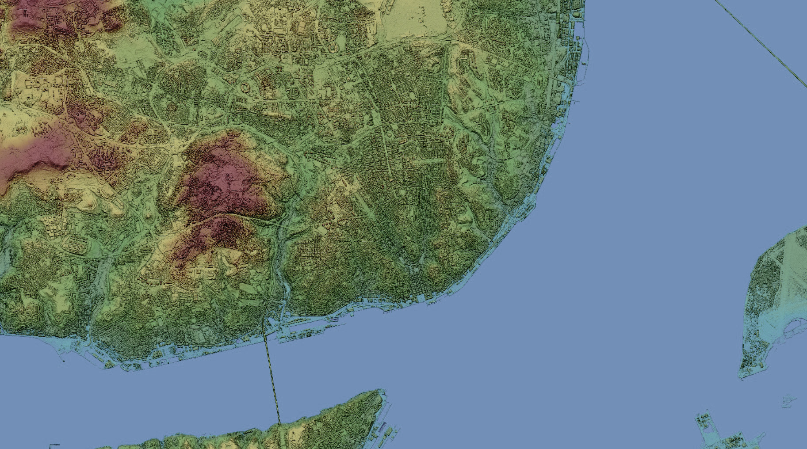

---

|:artificial_satellite: Pléiades | :round_pushpin: Франція |:camera: тип - PPléiades tri-stereo and mono |роздільна здатність -  0,5 m | [:moneybag: заказ ](https://www.intelligence-airbusds.com/en/4871-ordering)|[:earth_americas:  приклад](https://www.kaggle.com/sergiishchus/pliades-3d-textured-model-of-dubai-uae)|

  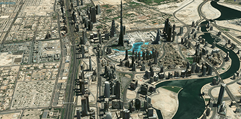

---

|:artificial_satellite: Sentinel-1 | :round_pushpin: ЄС|:camera: тип - активний сенсор (радар) |роздільна здатність -  20 m | [:free: заказ ](https://www.esa.int/)|[:earth_americas:  приклад](https://upload.wikimedia.org/wikipedia/commons/4/46/Lake_Success%2C_California_ESA373671.jpg)|

  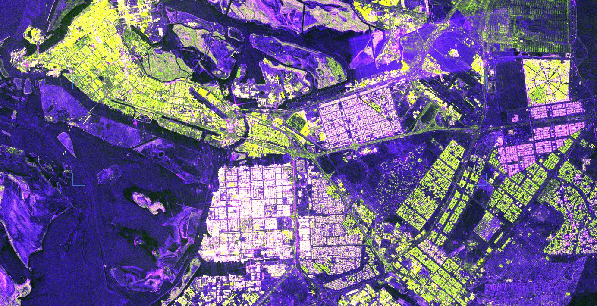

---

|:artificial_satellite: Sentinel-2 | :round_pushpin: ЄС|:camera: мультіспектральна |роздільна здатність -  10 m | [:free: заказ ](https://www.esa.int/)|[:earth_americas:  приклад](https://upload.wikimedia.org/wikipedia/commons/7/72/Lake_Balaton_Hungary%281%29.jpg)|

  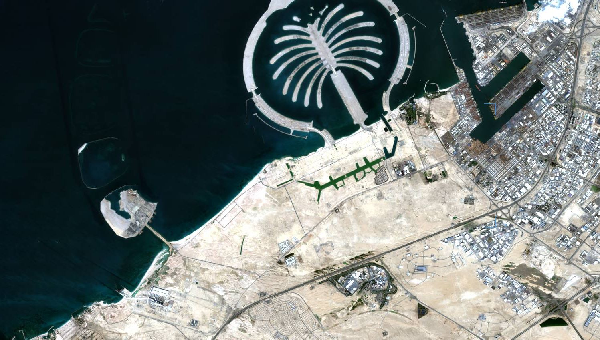

---

|:artificial_satellite: Landsat-8 | :round_pushpin: NASA|:camera: мультіспектральна |роздільна здатність -  30 m | [:free: заказ ](https://www.esa.int/)|[:earth_americas:  приклад (у реальному часі)](https://earthnow.usgs.gov/observer/)|

  

---

|:artificial_satellite: MAXAR | :round_pushpin: USA|:camera: мультіспектральна |роздільна здатність -  0,15 m | [:moneybag: заказ ](https://discover.digitalglobe.com/)|[:earth_americas:  приклад ](https://earthnow.usgs.gov/observer/)|

  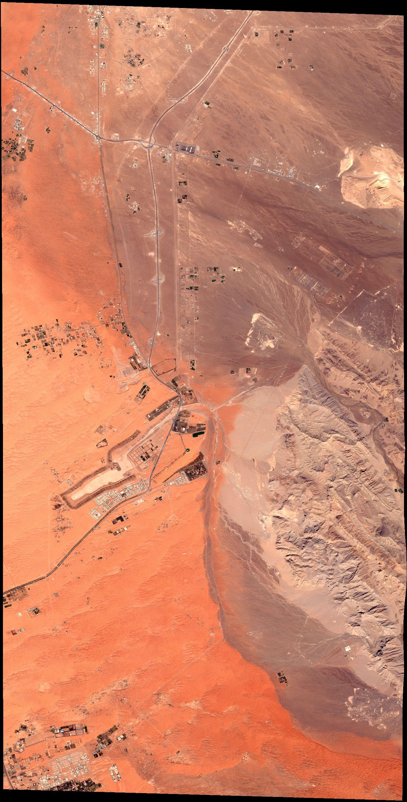

  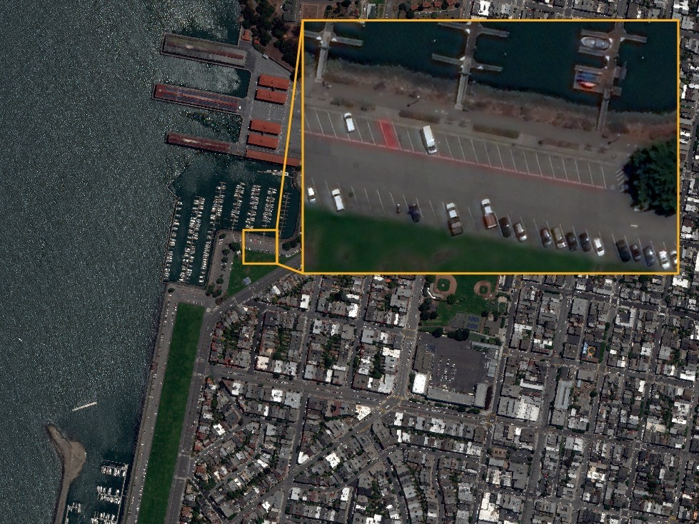

  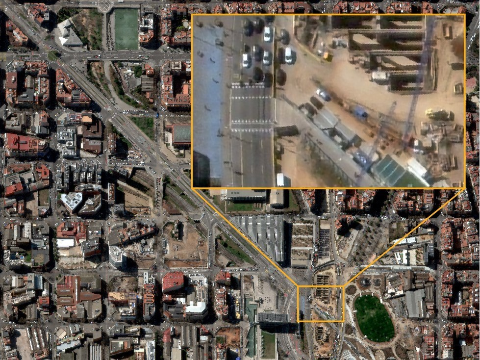

  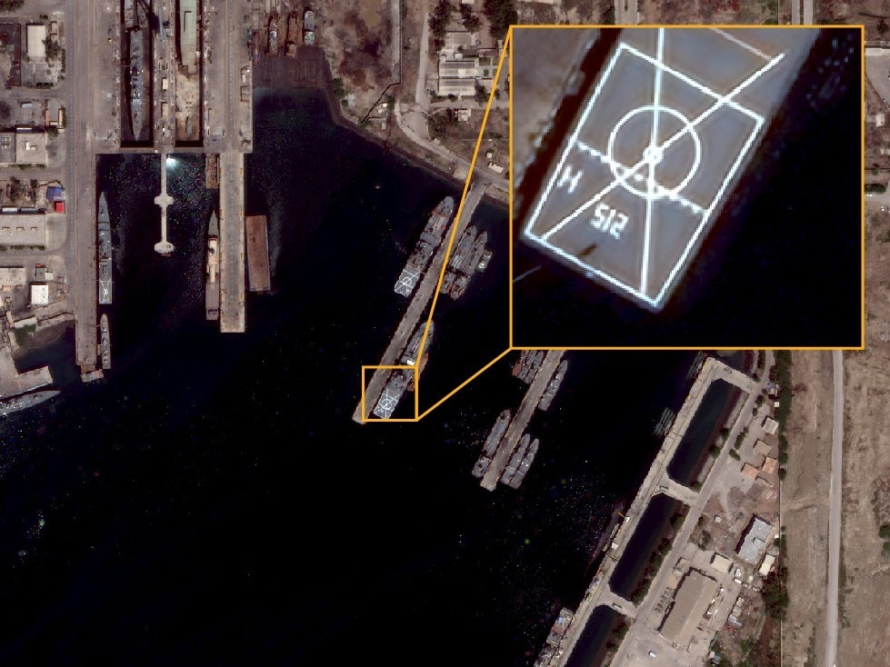

---